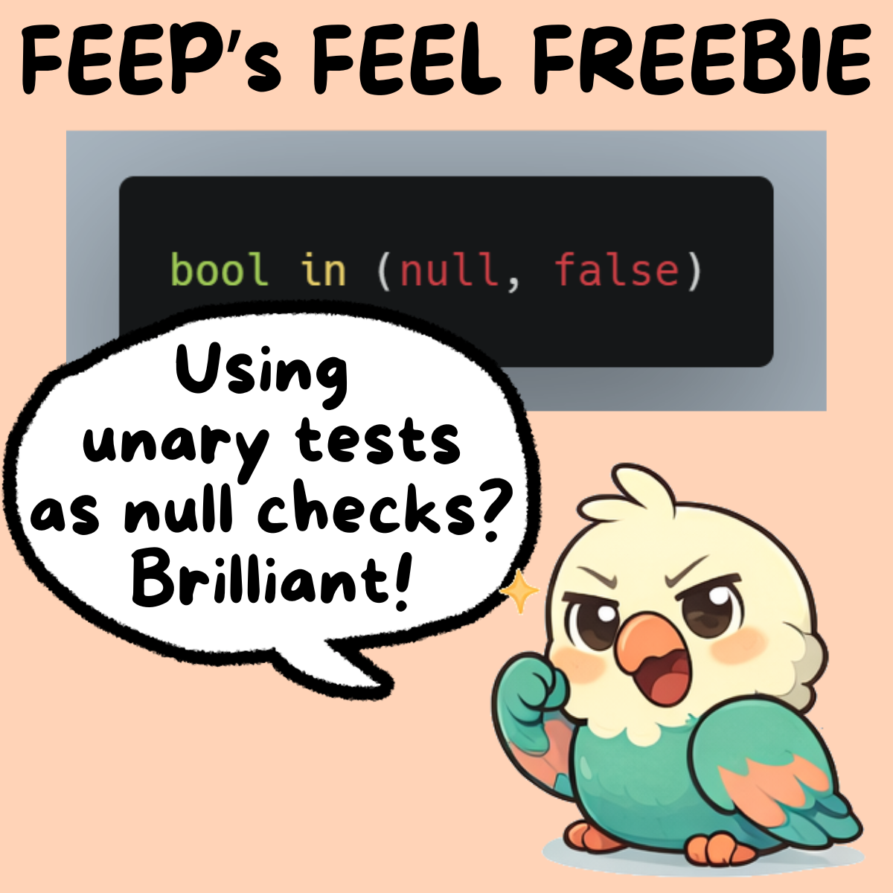

<div>

</div>

# Null Checks - Using Unary Tests
When working with conditions on exclusive or inclusive gateways in a BPMN process or with hide conditions in forms, null checks are essential.

A null value in a condition will cause an incident in Camunda 8. A null value in a hide condition in a form can cause unexpected behaviour. As of mid 2026, the Camunda Tasklist V2 and the form library from bpmn.io behave differently when processing null values in hide conditions.

Another common use case is returning a value if the value is non-null, but returning something else if it is null.

## The Issue
It is not always feasible to ensure that all variables used in a FEEL expression exist. When you hide a form component, its data is not available in the form output. You might use the non-existance of a boolean to perform a specific check, and later rely on its true or false value for other purposes, etc. We won't dwell on this here.

In addition to a value being null for various reasons (it was not set, a field in a `context object` does not exist,...), we sometimes also want to check that a string is not an empty string, or a list is not empty, etc. So a null check is nice, but we often want to check even more.

We can make use of `unary tests` in FEEL expressions by using the keyword `in`. On the left side is the `implicit input` of the `unary test`, and on the right side is the `unary test` itself. It will evaulate to either true or false (or null if you make a mistake).

A major benefit of using a unary test is that the variable in question is only mentioned once. The variable might even be the result of a more complex expression. If you didn't use unary tests, you might need to write down the expression twice or define a local variable as part of a `context object`.

## The Solution

### Checking a Boolean
In this context, a boolean can have three states: null, false, true.

Our FEEL expression could check various scenarios:
```js
// null or false
bool = null or not(bool)
bool = null or bool = false
```

```js
// not null and true
bool != null and bool
bool != null and bool = true
// using De Morgan's laws
not(bool = null or not(bool))
not(bool = null or bool = false)
```

As we check two states of the boolean, we need to mention it two times and use `and` or `or` for the logical connection. Or do we?

Using `unary tests`, we can also write:
```js
// null or false
bool in (null, false)
```

```js
// not null and true
not(bool in (null, false))
```

The first example is easy to understand. If `bool` is either `null` or `false`, the expression evaulates to `true`. Interestingly, the second example is its negation. Only if `bool` is exactly `true`, not `null` or `false`, the expression evaluates to `true`, else `false`. This behaviour is different from just stating `bool` itself, as it might be `null`.

It might take some time to adjust to this style of checking booleans, but it is worth it, in my opinion. Using `unary tests` enables us to only mention a boolean once (imagine it has a very long name...) and to avoid using `and` and `or`. Thus, we can probably avoid some multi-line shenanigans.

In a later post, I will present my prefered formatting when working with convoluted conjunctions (and) and disjunctions (or).

### Checking a String
The same approach works with strings as well.

```js
// not null and not empty
str != null and str != ""
not(str = null or str = "")
not(str in (null, ""))
```

Similarly, you can check against other unwanted values as well.

### Checking a List
Using a list, we can either check against `[]`, but if that makes you uncomforable (and I don't know if there might be an issue here), we can also make use of the function `count()`. If `count` acts on `null`, it returns `null`.
```js
// not null and not empty
someList != null and someList != []
not(someList = null or someList = [])
not(someList in (null, []))
// with count
count(someList) != null and count(someList) > 0
not(count(someList) = null or count(someList) = 0)
not(count(someList) in (null, 0))
```

Combining this with our [fun with lists](../01-introduction-fun-with-lists/introduction-fun-with-lists.md), we can combine the null check with the check for the existance of an item specified by a filter expression:
```js
not(count(jungle[type = "parrot" and mood = "grumpy"]) in (null, 0))
```

If `jungle` is `null`, `count` returns `null`. The unary test evaluates to `true` and with the negation, we get `false`. 

If `jungle` is a proper list, but does not contain an item that fulfils the filter expression, we count an empty list and get 0. The unary test evaluates to `true` and with the negation, we get `false`.

### Checking a Context Object
Theoretically, we could get the entries and check their count. Here, I present the simple version:
```js
// null or empty
someContext = null or someContext = {}
someContext in (null, {})
```

```js
// not null and not empty
someContext != null and someContext != {}
not(someContext = null or someContext = {})
not(someContext in (null, {}))
```

### Other Data Types
The some approach works for other data types as well. They behave quite similarly to the data types discussed above. 

## Try It Yourself
You can jump directly into the new Scala FEEL Playground with these links:

* [Boolean not null or false](https://feel-playground.camunda.com/playground/index.html?expression-type=expression&expression=bm90KGJvb2wgaW4gKG51bGwsIGZhbHNlKSk%3D&context=ewogICJib29sIjogbnVsbAp9)
* [String not null or empty](https://feel-playground.camunda.com/playground/index.html?expression-type=expression&expression=bm90KHN0ciBpbiAobnVsbCwgIiIpKQ%3D%3D&context=ewogICJzdHIiOiBudWxsCn0%3D)
* [List not null or empty](https://feel-playground.camunda.com/playground/index.html?expression-type=expression&expression=bm90KGNvdW50KHNvbWVMaXN0KSBpbiAobnVsbCwgMCkp&context=ewogICJzb21lTGlzdCI6IFtdCn0%3D)
* [Context object not null or empty](https://feel-playground.camunda.com/playground/index.html?expression-type=expression&expression=bm90KHNvbWVDb250ZXh0IGluIChudWxsLCB7fSkp&context=ewogICJzb21lQ29udGV4dCI6IHt9Cn0%3D)
* [Moody parrot in jungle with null check](https://feel-playground.camunda.com/playground/index.html?expression-type=expression&expression=bm90KGNvdW50KGp1bmdsZVt0eXBlID0gInBhcnJvdCIgYW5kIG1vb2QgPSAiZ3J1bXB5Il0pIGluIChudWxsLCAwKSk%3D&context=ewogICJqdW5nbGUiOiBbCiAgICB7CiAgICAgICJ0eXBlIjogInNuYWtlIiwKICAgICAgIm1vb2QiOiAiZGVwcmVzc2VkIgogICAgfSwKICAgIHsKICAgICAgInR5cGUiOiAicGFycm90IiwKICAgICAgIm1vb2QiOiAiZ3J1bXB5IgogICAgfQogIF0KfQ%3D%3D)